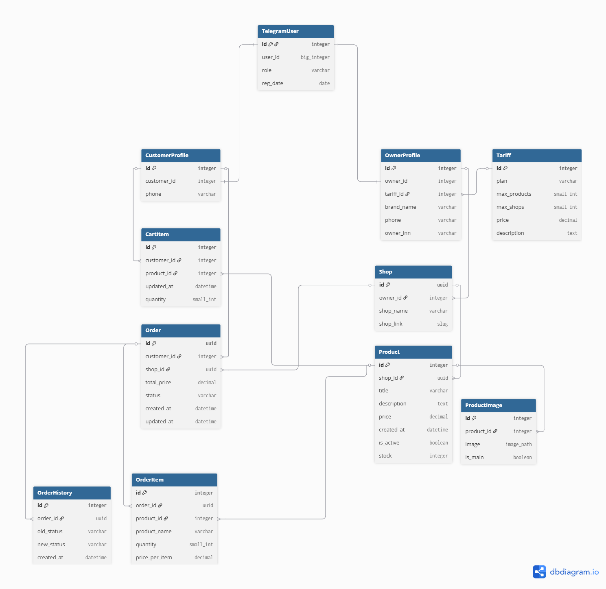

# 🚀 Telegram SaaS CRM (Backend MVP)

## 🛠 Tech Stack (Backend Power)

-  **Python 3.12** — Ядро системы
- 💚 **Django Ninja** — Скоростной API (FastAPI Style)
- 🐘 **PostgreSQL** — Надежное хранилище данных
- 🐳 **Docker** — Контейнеризация и деплой

## 🏗 Ключевые архитектурные решения
* **Telegram-Native Auth:** Регистрация и идентификация пользователей по `tg_id`.
* **SaaS Logic:** Реализована сущность "Владелец" (Owner), позволяющая мерчантам управлять своими брендами и точками продаж.
* **Security First:** Удаление и редактирование товаров защищено многоуровневой фильтрацией (`shop -> owner -> user`). Пользователь может управлять только своим контентом.

## 🚀 Основные эндпоинты (MVP)
* `POST /register` — Регистрация мерчанта (ИНН, бренд, телефон).
* `POST /shop` — Создание новой торговой точки.
* `POST /product` — Наполнение каталога.
* `DELETE /product/{id}` — Безопасное удаление с проверкой прав доступа.
* `GET /products` — Общий список товаров с поддержкой пагинации.

## 📊 Схема данных
Проект построен на четкой иерархии сущностей:
- **User**: Системный аккаунт (связка с Telegram ID).
- **Owner**: Профиль мерчанта с бизнес-данными (ИНН, реквизиты).
- **Shop**: Торговая точка, принадлежащая владельцу (связь One-to-Many).
- **Product**: Товарная единица внутри конкретного магазина.

## 🔥 Особенности реализации
- **Type Safety**: Полная типизация запросов и ответов через Pydantic-схемы в Django Ninja.
- **Fast Pagination**: Оптимизированный вывод списков товаров для работы под нагрузкой.
- **Decimal Precision**: Использование Decimal для цен, что исключает ошибки округления при финансовых расчетах.

## 🏗 Архитектура базы данных (Backend MVP)

Проект спроектирован с учетом масштабируемости (SaaS-модель) и строгой целостности данных. Ниже представлена визуализация связей между сущностями:

### Ключевые узлы архитектуры:
*   **Иерархия доступа**: `TelegramUser` ➔ `OwnerProfile` ➔ `Shop` ➔ `Product`. Такая цепочка позволяет реализовать безопасное управление контентом на уровне SQL-запросов.
*   **Финансовая стабильность**: В модели `OrderItem` реализована денормализация данных (сохранение цены и названия товара на момент покупки), что гарантирует неизменность истории заказов при изменении каталога.
*   **Логирование**: Сущность `OrderHistory` обеспечивает полный аудит изменений статусов заказов.
*   **Масштабируемость**: Связь `Tariff` ➔ `OwnerProfile` позволяет гибко управлять лимитами магазинов и товаров для разных уровней подписки мерчантов.

## 📽 Демонстрация работы
*(Здесь будет ссылка на ютуб канал)*

## 🛠 Установка и запуск
1. Клонировать репозиторий.
2. Настроить окружение `.env`.
3. Запустить миграции: `python manage.py migrate`.
4. Запуск сервера: `python manage.py runserver`.
